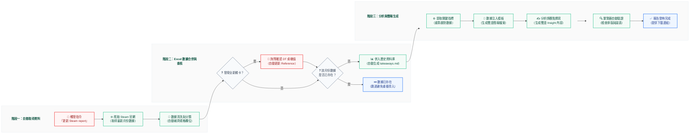

# Steam 玩家硬體趨勢報告 — 自動化流程
一句話觸發（例如「**更新最新的 Steam report**」），AI 助理即完成
**爬取官網 → 合併資料 → 數據分析 → 產出雙語簡報**的完整流程。

> 🟩 綠色 = 全自動　🟧 橘色 = 需要你介入　🟦 藍色 = 結束 / 產出

## 重點說明
- **月份慣例**：N 月執行 → 抓 N-1 月（最新公布的調查）。Steam 通常每月頭幾天才公布上月數據。
- **唯一需人工的環節**：只有當出現對照表沒收錄的「全新顯卡型號」時，AI 才會詢問該卡是否為桌機卡（DT 值）；多數月份完全自動。
- **防呆**：同一個月不會重複併入，避免資料倉被污染。
- **資料來源**：[Steam Hardware Survey](https://store.steampowered.com/hwsurvey/)（官方公開調查）。
